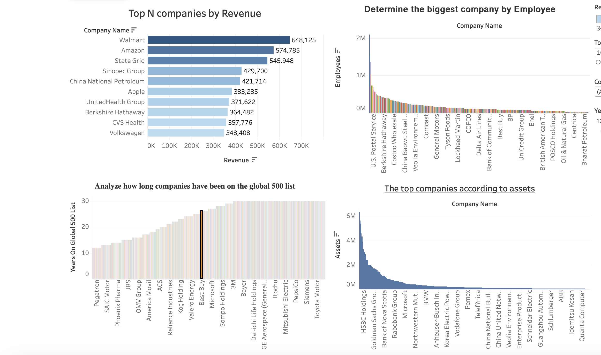
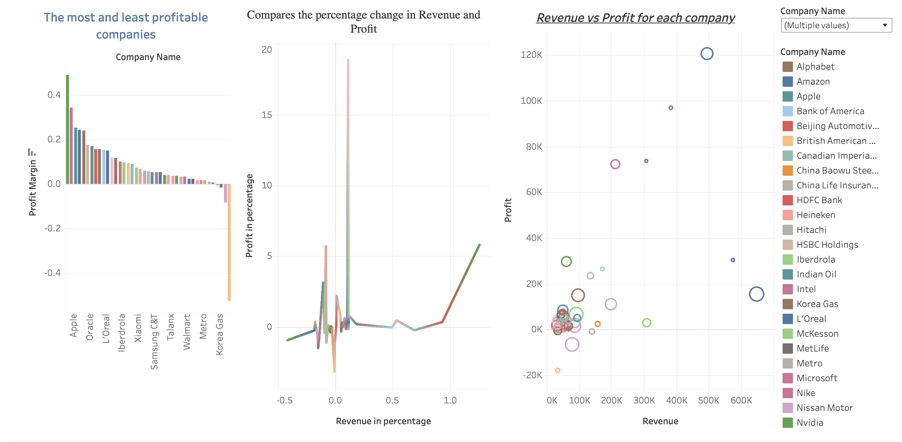

# 📊 Fortune Global: A Tableau Journey

## 📝 Project Overview  
This project visualizes insights from the **Fortune Global 500 dataset**, highlighting key trends and financial performance of the world's top companies. 

## 📊 Interactive Dashboards  

### 🔹 Fortune Global 500: Key Insights on Top Companies  
  

### 🔹 Financial Performance Analysis: Revenue, Profit, Profit Margins  
  

🔗 **[Explore Full Dashboards on Tableau Public](https://public.tableau.com/app/profile/mohammad.fayez.ullah/viz/FortuneGlobal500KeyInsightsintoTopCompanies/FortuneGlobal500KeyInsightsintoTopCompanies)**  

## 📈 Key Insights from the Dashboards  

### 🔹 **1. The Most and Least Profitable Companies**
- **Highest Profit Margins:**  
  - **Apple, Oracle, L’Oréal, Iberdrola, Xiaomi**  
  - These companies maintain high-profit margins due to **strong brand positioning and efficient cost management**.
  
- **Lowest Profit Margins:**  
  - **Korea Gas, Metro, Walmart, Talanx, Samsung C&T**  
  - Some of these operate on **low-margin, high-volume models**, while others have high operational costs.

### 🔹 **2. Revenue vs. Profit Analysis**
- Companies with **high revenue do not always translate to high profit**.
- **Tech Giants** like **Apple, Microsoft, and Nvidia** maintain high profitability despite varied revenue levels.
- **Retail Giants** like **Walmart** generate **huge revenue** but operate on thin profit margins.

## 🔄 Project Workflow  
This project was completed in the following steps:  

1. **Data Scraping** 🕵️‍♂️  
   - Scraped the **Fortune Global 500 dataset** using **Selenium** to extract company details, revenue, profit, and other financial metrics.  

2. **Data Cleaning & Preprocessing** 🛠️  
   - Processed the scraped dataset using **Python** and libraries such as **Pandas** and **NumPy** to clean, structure, and prepare the data for visualization.  

3. **Data Visualization** 📊  
   - Used **Tableau** to create interactive dashboards with key insights from the cleaned dataset.  

4. **Publishing & Sharing** 🚀  
   - Uploaded dashboards to **Tableau Public** and pushed all files to **GitHub** for accessibility.  

### 🔍 Dashboards Created:
1. **[Fortune Global 500: Key Insights on Top Companies](https://public.tableau.com/shared/3QKCJ3JX4?:display_count=n&:origin=viz_share_link)**
   - Overview of the largest companies.
   - Key financial figures and industry comparisons.

3. **[Financial Performance Analysis: Revenue, Profit, and Profit Margins](https://public.tableau.com/views/FinancialPerformanceAnalysisRevenueProfitandProfitMargins/FinancialPerformanceAnalysisRevenueProfitandProfitMargins?:language=en-GB&:sid=&:redirect=auth&:display_count=n&:origin=viz_share_link)**
   - Revenue vs. profit analysis.
   - Profit margin distribution among top companies.
   - Comparative analysis across industries.
     

## 📊 Dataset
- The dataset that is used in this project is the *[Fortune Global 500 dataset](https://fortune.com/ranking/global500/)*, which includes revenue, profit, and other key financial metrics of the top companies globally.

## 📂 Files in This Repository  
- `Fortune500_Company.py` - The Python script used for web scraping with Selenium.
- `visualization.ipynb` - The Python script for Data Processing, Transformation, Manipulation.
- `World_best_Company_details.csv` - The Dynamic dataset that  was scrapped by using selenium for tableau visualisation.
- `Cleaned_World_Best_Companies.csv` - The cleaned dataset after processing.
- `Fortune Global 500- Key insights on to top companies.twbx` - The Tableau Packaged Workbook containing dashboard of key insight on to top companies.
- `Financial Performance Analysis: Revenue, Profit, and Profit Margins.twbx` - The Tableau Packaged Workbook containing dashboard of Financial Performance Analysis.
- `README.md` - Documentation about the project.

## 🚀 How to Use  
1. Open the Tableau dashboards using the provided **Tableau Public links**.  
2. Download the `.twbx` files and open it with **Tableau Desktop** for further exploration.

## 📢 Contact

For any further questions about this project, please feel free to reach out! 🚀  

